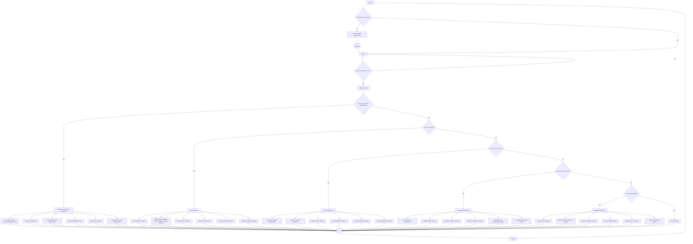

# Build Watch - Santa Cruz, Laguna Project Monitoring System

## System Case Flowchart

## User Role Descriptions

### System Administrator
- **Primary Function**: System management and user administration
- **Key Responsibilities**:
  - User account creation and management
  - System configuration and maintenance
  - Database backup and recovery
  - System health monitoring
  - Activity log review and analysis

### EIU (External Implementing Unit)
- **Primary Function**: Project implementation and progress reporting
- **Key Responsibilities**:
  - Manage assigned projects
  - Submit regular progress updates
  - Monitor project milestones
  - Access project documentation
  - Submit compliance reports

### LGU-IU (Local Government Unit - Implementing Office)
- **Primary Function**: Local project management and oversight
- **Key Responsibilities**:
  - Manage department projects
  - Monitor project timelines
  - Submit project updates
  - Track milestone progress
  - Access project documents

### Secretariat
- **Primary Function**: Project review and validation
- **Key Responsibilities**:
  - Review project submissions
  - Validate project reports
  - Compile project summaries
  - Monitor submission tracking
  - Coordinate with implementing offices

### MPMEC (Municipal Project Monitoring and Evaluation Committee)
- **Primary Function**: Executive oversight and reporting
- **Key Responsibilities**:
  - Review approved projects
  - Monitor overall project progress
  - Access executive reports
  - View committee profiles
  - Track events and schedules

## System Flow Summary

1. **Authentication**: Users must have valid credentials to access the system
2. **Role Verification**: System determines user access level and available functions
3. **Dashboard Access**: Users are directed to role-specific dashboards
4. **Function Execution**: Users can perform authorized actions within their role
5. **Session Management**: Users can logout and return to the authentication process

This flowchart provides a comprehensive overview of the Build Watch system's user management and role-based access control structure. 